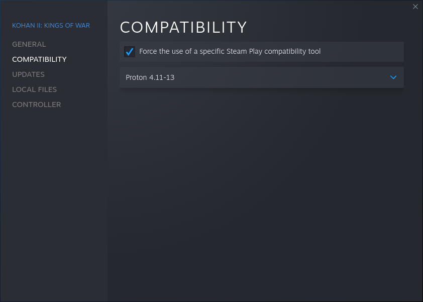

# Fixing font locations for Kohan II

Kohan II ProtonDB entry is [here](https://www.protondb.com/app/97130).

## Steam configuration

In the steam app, if you bring up the properties, there is a setting to choose which version of Proton to use.



Versions of Proton:

* `4.11-13` definitely works
* `5.x` does NOT work
* `6.3-8` seems to have some rendering problems (such as unit "tags" become a black box before being replaced with the correct indicator of in battle, in supply, etc)
* `7.0-3` similar to `6.3-8`

## Extract font files and copy into shared location

For Steam under Linux, Kohan II placed game files in `~/.steam/steam/steamapps/common/Kohan II` on my machine.
These notes assume that is normal/standard.

Navigate into the Kohan II directory:

```
$ cd ~/.steam/steam/steamapps/common/Kohan\ II
```

Extract the fonts:

> I've included a preview and "postview".

```
$ gorwd -lf Data.rwd *.TTF
849. Fonts/TrueType/VILLAGE.TTF (o=180804584, l=48428)
1226. Fonts/TrueType/LBRITED.TTF (o=180737860, l=66724)
9972. Fonts/TrueType/DANIELA.TTF (o=180689488, l=48372)
$ gorwd -xf Data.rwd *.TTF
$ tree Fonts/
Fonts/
└── TrueType
    ├── DANIELA.TTF
    ├── LBRITED.TTF
    └── VILLAGE.TTF

1 directory, 3 files
```

Copy these font files into shared location:

```
$ mkdir -p ~/.local/share/fonts
$ cp Fonts/TrueType/*.TTF ~/.local/share/fonts
$ ls -l ~/.local/share/fonts
total 164
-rw-rw-r-- 1 rob rob 48372 Jul 16 10:56 DANIELA.TTF
-rw-rw-r-- 1 rob rob 66724 Jul 16 10:56 LBRITED.TTF
-rw-rw-r-- 1 rob rob 48428 Jul 16 10:56 VILLAGE.TTF
```

## Patch configuration files in the Warchest directory

The configuration files exist in the `Warchest` subdirectory.

Navigate into the `Warchest` subdirectory:

```
$ cd ~/.steam/steam/steamapps/common/Kohan\ II/Warchest
```

Extract the configuration files:

> There are only 5 and they are small, so we can extract it in place.

```
$ gorwd -xf Warchest.rwd
$ ls -l
total 24
-rw-rw-r-- 1 rob rob  595 Jul 16 10:43 AVars_version.tgi
drwxrwxr-x 2 rob rob 4096 Jul 16 10:43 Fonts
-rwxrwxr-x 1 rob rob 7496 Jul 16 10:42 Warchest.rwd
```

Now, launch your favorite editor and edit those files:

> I'm using VS Code since it's really handy for things like this; they are just text files, so any editor works fine

```
$ code .
```

There are font entries in `font_medium.tgi` and `font_large.tgi` on line 39. Change it to just the font name, and remove the `.TTF` from the filename (note the comments). So they will look like `font = LBRITED` and `font = VILLAGE`.

Now, update the file with the changes:

> Note that update will create a `.bak` backup file. It will also fail if this file exists already!

```
$ gorwd -uf Warchest.rwd
Updating file 'Fonts/font_medium.tgi' in archive.
Updating file 'Fonts/font_tiny.tgi' in archive.
Updating file 'Fonts/font_large.tgi' in archive.
Updating file 'Fonts/font_small.tgi' in archive.
Updating file 'AVars_version.tgi' in archive.
$ ls -l
total 32
-rw-rw-r-- 1 rob rob  595 Jul 16 10:43 AVars_version.tgi
drwxrwxr-x 2 rob rob 4096 Jul 16 10:43 Fonts
-rwxrwxr-x 1 rob rob 7496 Jul  4 15:17 Warchest-orig.rwd
-rw------- 1 rob rob 7460 Jul 16 10:43 Warchest.rwd
-rwxrwxr-x 1 rob rob 7496 Jul 16 10:42 Warchest.rwd.bak
```

Now you should be able to play Kohan II!
